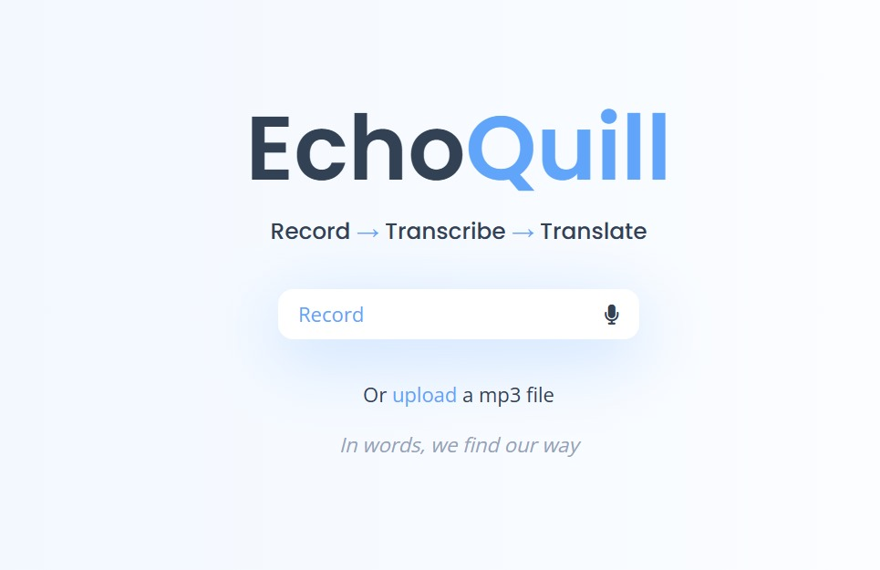
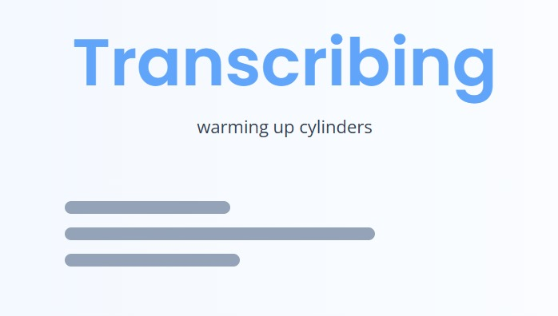
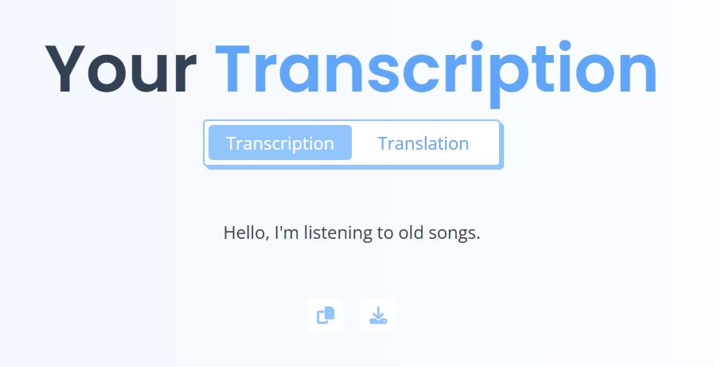

# echoquill
a voice-based tool to speak, transcribe, and translate - instantly.

---

## what it does  
- captures audio through mic or mp3 upload  
- transcribes speech in real-time  
- translates to your chosen language  
- works across 20+ languages  
- perfect for notes, learning, or bridging communication gaps

---

## how it works  

### step 1: record or upload  
use the built-in mic or drop an mp3 file.

### step 2: choose your languages  
select your source (spoken) and target (translated) languages.

### step 3: get instant results  
receive accurate transcription + translation in seconds.

---

## ## fragments of the interface

  
  
  

---

## tech stack  
- react.js, tailwind  
- web speech api  
- tensorflow.js  
- google cloud translation api

---

*because voice is meant to be understood.* 
